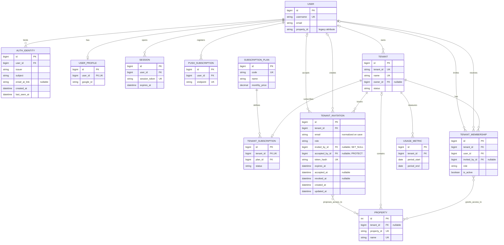
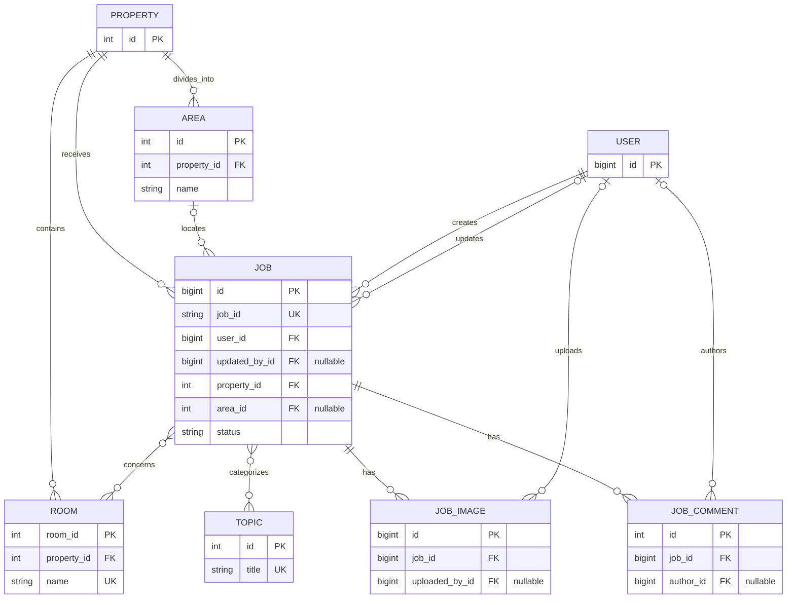
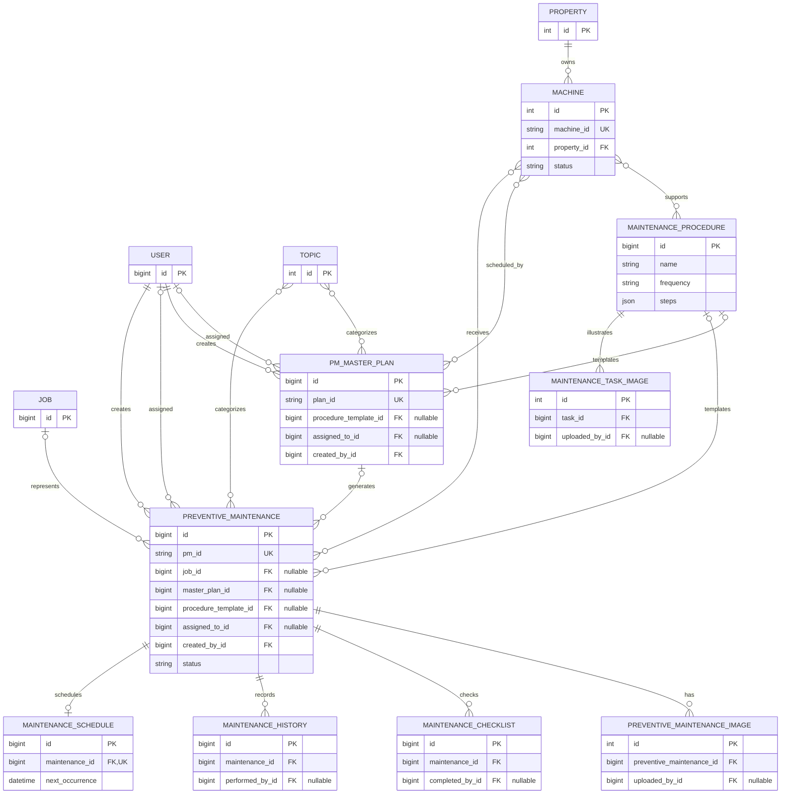
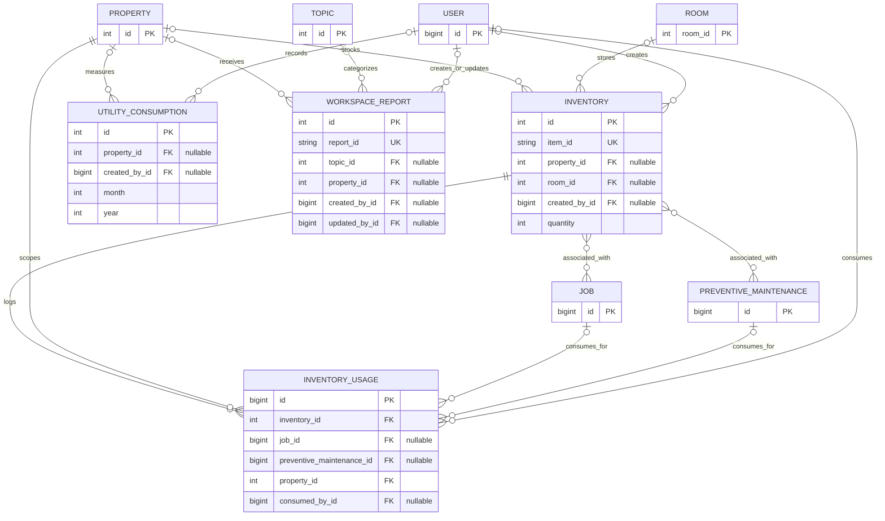

# Application ER Diagram

This is the current logical data model derived from `myappLubd/models.py`.
Django's implicit `id` primary keys and implicit many-to-many junction tables
are omitted where that keeps the diagrams readable. `UK` means unique key.

## Tenant, identity, and access

`AuthIdentity(issuer, subject)`, `TenantMembership(tenant, user)`, and
`UsageMetric(tenant, period_start, period_end)` are unique. `AuthIdentity` is
only the durable external-identity binding from a validated Auth0 JWT to a
canonical `User`; it grants no tenant or property access. A user may have many
external identities, and `email_at_link` records link-time context rather than
an authorization key.

`TenantInvitation.token_hash` is globally unique. The normalized `email` is
unique only while both `accepted_at` and `revoked_at` are null. Database checks
require `accepted_at` and `accepted_by` to be either both null or both set, and
prevent an invitation from being both accepted and revoked. Deleting an
accepting user is blocked by `accepted_by=PROTECT`; deleting an inviter sets
`invited_by` to null. Invitation properties use an implicit many-to-many
junction table and describe the grants proposed for acceptance.

`Property.tenant` remains nullable in the current model and migration state;
this is a current schema fact, not a transitional migration note. For
tenant-backed properties, application authorization is derived only from an
active `TenantMembership`: owner/admin/manager roles are tenant-wide and other
roles use the membership's property grants. Invitations do not grant access
until acceptance creates or confirms that canonical membership. The legacy
`User.property_id` attribute is not an authorization relationship. See
[tenant_access_er_diagram.md](tenant_access_er_diagram.md) for the complete
authentication and authorization boundary.

## Work orders and location

`Area(property, name)` is unique. `Job.rooms` and `Job.topics` use implicit
junction tables.

## Preventive maintenance and assets

Image, checklist, and history uploader/actor fields point to `User`.
`PreventiveMaintenance` also has optional `completed_by` and `verified_by`
links to `User`; they are omitted above to reduce crossing lines.

## Inventory, utilities, and reports

`UtilityConsumption(property, month, year)` is unique. An `InventoryUsage`
may reference a job or preventive-maintenance task, but model validation rejects
referencing both at once.
