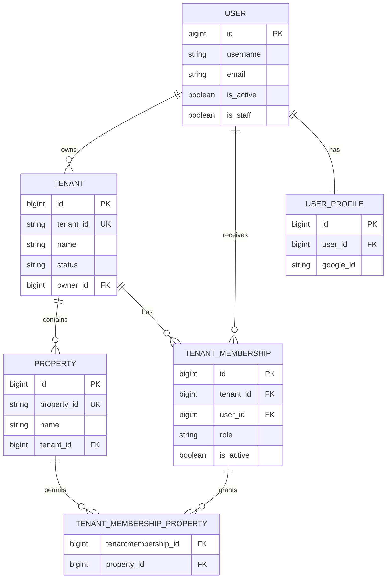

# Tenant and Property Access ER Diagram

This diagram documents the tenant/access boundary. Tenant-backed authorization
is derived from `TenantMembership` and its property grants. The former
`Property.users` and `UserProfile.properties` relations were removed by
migration `0077`.

Authorization semantics:

- `owner`, `admin`, and `manager` are tenant-wide roles.
- `supervisor`, `technician`, `viewer`, and `billing` are restricted to the
  `TenantMembership.properties` grants.
- The old direct property-user access paths no longer exist in the current
  schema; `TenantMembership.properties` is the canonical property grant.
- `User.is_staff` / `User.is_superuser` retain the application’s existing
  platform-admin bypass and are not represented by a TenantMembership grant.
