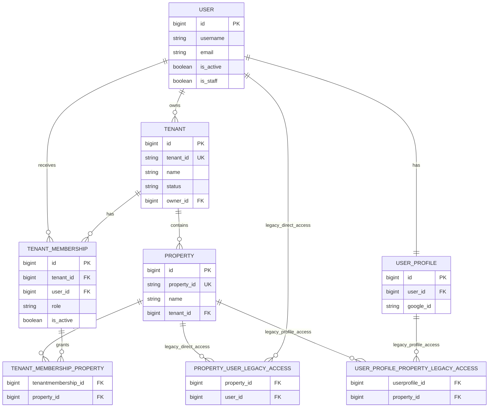

# Tenant and Property Access ER Diagram

This diagram documents the Phase A.3 tenant/access boundary. The two legacy
access relations remain in the schema for compatibility; tenant-backed
authorization is derived from `TenantMembership` and its property grants.

Authorization semantics:

- `owner`, `admin`, and `manager` are tenant-wide roles.
- `supervisor`, `technician`, `viewer`, and `billing` are restricted to the
  `TenantMembership.properties` grants.
- `Property.users` and `UserProfile.properties` are legacy compatibility
  paths. They are not the canonical authorization source for tenant-backed
  properties.
- `User.is_staff` / `User.is_superuser` retain the application’s existing
  platform-admin bypass and are not represented by a TenantMembership grant.
