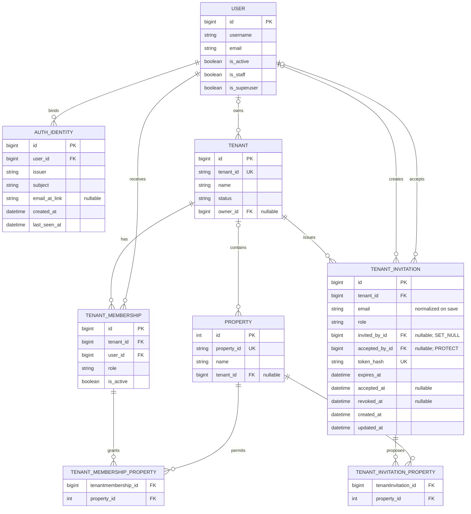

# Tenant and Property Access ER Diagram

This diagram separates external authentication identity, invitation onboarding,
and application authorization. The canonical chains are:

```text
Auth0 JWT -> AuthIdentity -> Django User

Django User -> active TenantMembership -> Tenant -> Property grants
```

`AuthIdentity` proves which canonical user authenticated; it grants no tenant,
role, or property authority. A `TenantInvitation` proposes a role and optional
property grants, but authority begins only when acceptance creates or confirms
the canonical `TenantMembership`.



Authentication and onboarding semantics:

- `AuthIdentity` has a unique `(issuer, subject)` pair and a required `user`
  foreign key (`related_name="auth_identities"`). A user can have many identity
  bindings. `email_at_link` is historical link-time context; changing a
  presented email does not relink an existing identity.
- `TenantInvitation.email` is normalized on save. `token_hash` is unique, and
  the normalized email is unique while an invitation is unresolved
  (`accepted_at IS NULL` and `revoked_at IS NULL`).
- Reverse relations are `Tenant.invitations`,
  `User.created_tenant_invitations`, `User.accepted_tenant_invitations`, and
  `Property.tenant_invitations`.
- Acceptance requires `accepted_at` and `accepted_by` to be set together. An
  invitation cannot be both accepted and revoked. `accepted_by` uses `PROTECT`,
  preserving acceptance history; `invited_by` uses `SET_NULL`.
- Invitation properties must belong to the invitation tenant. They become
  canonical grants only through the accepted `TenantMembership`.

Authorization semantics:

- `owner`, `admin`, and `manager` are tenant-wide roles.
- `supervisor`, `technician`, and `viewer` require explicit
  `TenantMembership.properties` grants. `billing` may have optional grants and
  has no property access when none are assigned.
- Only active memberships participate in tenant/property authorization.
- `Property.tenant` is currently nullable. Tenant-backed properties use the
  membership chain above; nullability is not an alternate authorization path.
- `User.is_staff` is Django-admin eligibility and is not application
  authorization. `User.is_superuser` is the explicit platform break-glass
  bypass and is not represented by a membership grant.

Historical note: migration `0077` removed the retired `Property.users` and
`UserProfile.properties` relations. Migration `0076` had already removed
`Room.properties`. None of those historical relationships is an authorization
input in the current schema.
